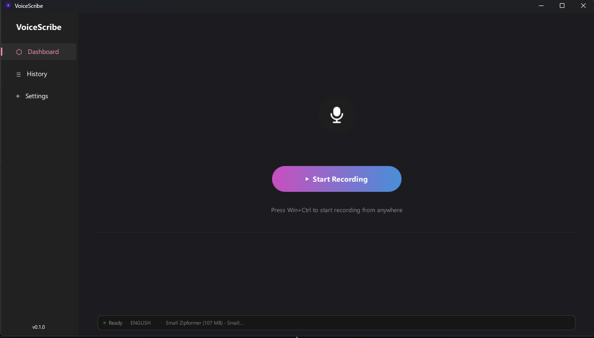
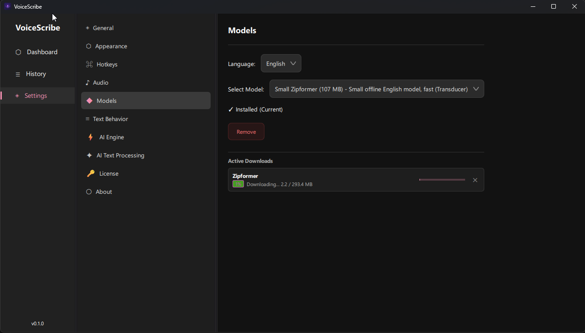

# VoiceScribe

**VoiceScribe** is a Windows desktop app for speech-to-text dictation — fast, private, and fully offline.  
Speak into your microphone, and the transcribed text is automatically typed wherever your cursor is: in any text editor, browser, chat, IDE, or document.

---

## Screenshots

---

## Key Features

- **Offline by default** — speech recognition runs 100% locally, your voice never leaves your computer. No internet required for dictation.
- **Works in any app** — text is inserted directly at the cursor position in any active window (browser, Word, Slack, VS Code, etc.).
- **Global hotkey** — start/stop recording from any app with a keyboard shortcut. Fully customizable — set any combination you prefer. Default is `Win+Ctrl`.
- **Multiple languages** — English, German, Chinese, Korean, and many others via dedicated language models.
- **Transcription history** — all your dictations are saved and searchable.
- **AI text post-processing** *(optional, requires internet)* — LLM-powered cleanup after each dictation: removes filler words (*"um"*, *"uh"*), fixes sentence boundaries, groups sentences into paragraphs, formats lists and enumerations.
- **Output language / translation** *(optional, requires internet)* — automatically translate the result into a different language. Dictate in German, get output in English — or any other combination.
- **Flexible text insertion modes** — insert at cursor, append to end of field, or replace selected text.
- **Pause detection** — silence automatically starts a new paragraph, so your dictated text is structured.
- **System tray** support — runs quietly in the background.
- **Microphone selection** — choose any input device from your system.

---

## System Requirements

- Windows 10 / 11 (64-bit)
- 4 GB RAM minimum (8 GB recommended for larger models)
- ~300–600 MB disk space for the app + model

---

## Installation

1. Download the latest installer from the [Releases](../../releases) page.
2. Run `VoiceScribe_Setup.exe` — no admin rights required, no internet needed during install.
3. Launch **VoiceScribe**.

---

## First-Time Setup: Downloading a Model

VoiceScribe requires a speech recognition model before you can start dictating.  
Models are downloaded once and stored locally.

### Step 1 — Open Settings → Models

Click **Settings** in the left sidebar, then select **Models** in the settings menu.

### Step 2 — Select your language

From the **Language** dropdown, choose the language you'll be dictating in.

> **Tip:** If you primarily speak one language, always pick a language-specific **Zipformer** model (e.g. *English*, *German*, *Chinese*, *Korean*, etc.) rather than *Multilingual*.  
> Language-specific Zipformer models are faster, have lower latency, and are **significantly more accurate** than a general-purpose Whisper multilingual model — because they are trained and optimized for one language only.

### Step 3 — Choose a model size

Each language offers several model options:

| Size | Quality | Use case |
|------|---------|----------|
| ~100 MB | Good | Fast machines, quick testing |
| **200–300 MB** | **Best** | **Recommended for everyday use** |

> **Recommendation:** Download a model that is **200 MB or larger** — they are significantly more accurate, handle accents better, and make fewer mistakes on uncommon words.  
> The extra download size is worth it for daily use.

### Step 4 — Download

Select the model from the **Select Model** dropdown and wait for the download to complete.  
A progress bar shows download status. You can cancel and resume if needed.

### Step 5 — Start dictating

Go back to **Dashboard** and press **Start Recording** (or use your hotkey `Win+Ctrl`).  
Switch to any app, and the transcribed text will be typed there automatically.

---

## Tips

- **Hotkey** — you don't need to keep VoiceScribe in focus. Press your configured hotkey in any window to toggle recording. Default is `Win+Ctrl`, change it in **Settings → Hotkeys**.
- **Pause = new paragraph** — natural pauses in speech are detected and converted into paragraph breaks automatically.
- **AI cleanup** — enable **AI Text Processing** in Settings for automatic punctuation and grammar corrections after each dictation.
- **Language hint** — if you notice the model mixing languages or making errors on domain-specific words, try switching to a larger model.

---

## Feedback & Support

Have a question, found a bug, or want to suggest a feature?  
Send an email to **noreply.voicescribe@gmail.com** — or use the **Send Feedback** button in **Settings → About**.

---

## License

VoiceScribe is commercial software. A license is required after the trial period.  
Manage your license in **Settings → License**.
